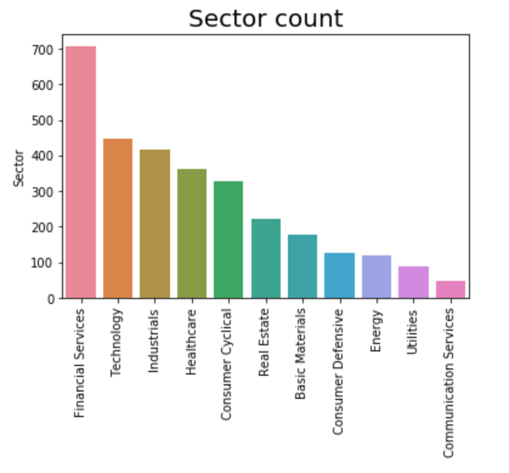
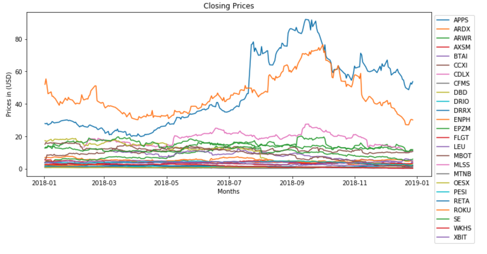
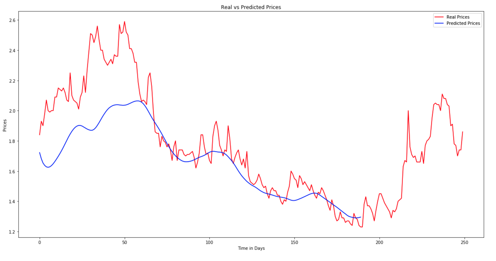

# Capstone Project - predicting stock market prices

## Data:

### The data was provided on Kaggle which included historical data from over 200 different stocks from the year 2014 through 2018.  I also pulled historical share prices from yahoo finance.

[https://www.kaggle.com/cnic92/200-financial-indicators-of-us-stocks-20142018](https://www.kaggle.com/cnic92/200-financial-indicators-of-us-stocks-20142018)

## Buisness Problem

When looking into what I wanted to do for the capstone project I was interested in trying to predict the stock market prices and what different techniques that I would learn in doing so.  

## EDA

with so many different stocks I wanted to see what category had the most.



then I sorted though the data and selected the stocks that had gains over 250%



## LSTM

Long Short Term Memory Results



LSTM Neural Network is trained using Kers to predict the following day's closing price.  I chose to use a LSTM model because it is better to deal with time series data. LSTM has a loop within each layer that allows previous inputs to stay in memory.

## Decision Tree model


The decision tree model looks pretty good at predicting the prices.  With a mean squared error of 0.215

## Conclusion

### Recommedations


I would recommend to look at stocks that have good gains so that you won't waste time on making a model on a stock that won't pay out much.

also research on what industries are becoming popular so you can use your models on them.

look for a company that has high dividend to see if it's worth running your models on it.

## Future work 

with more time I would like to go back to these models and perform more hypertuning tests on them to see how close I can predict the prices.

and adding more data to the LSTM model like more stock shares 

in my models the time span was over a year so I would like to see every day over a month or so.


```python

```
